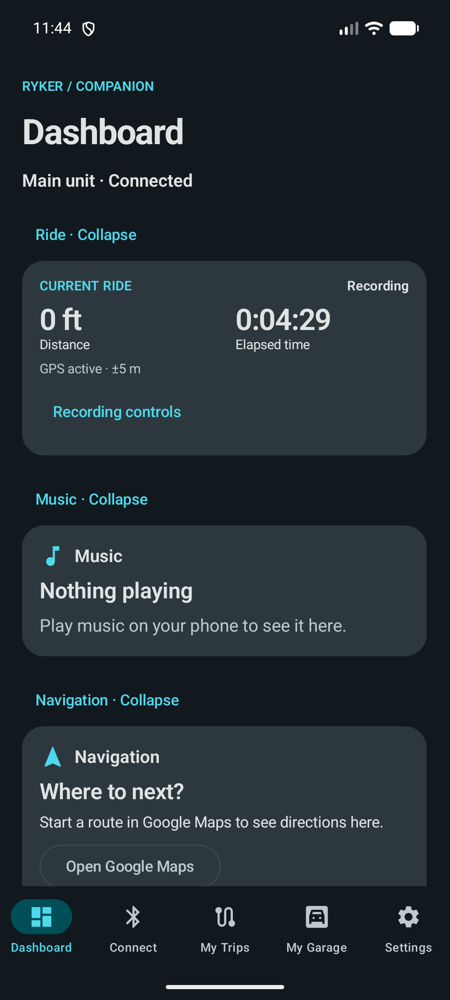
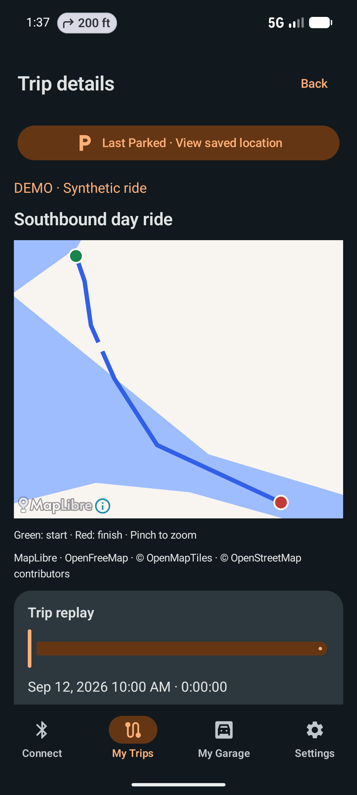
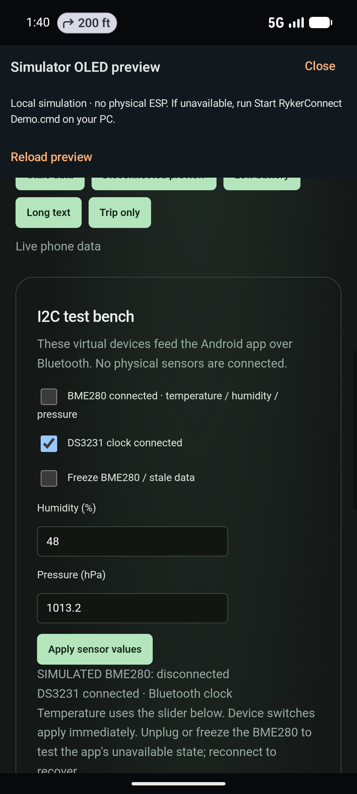
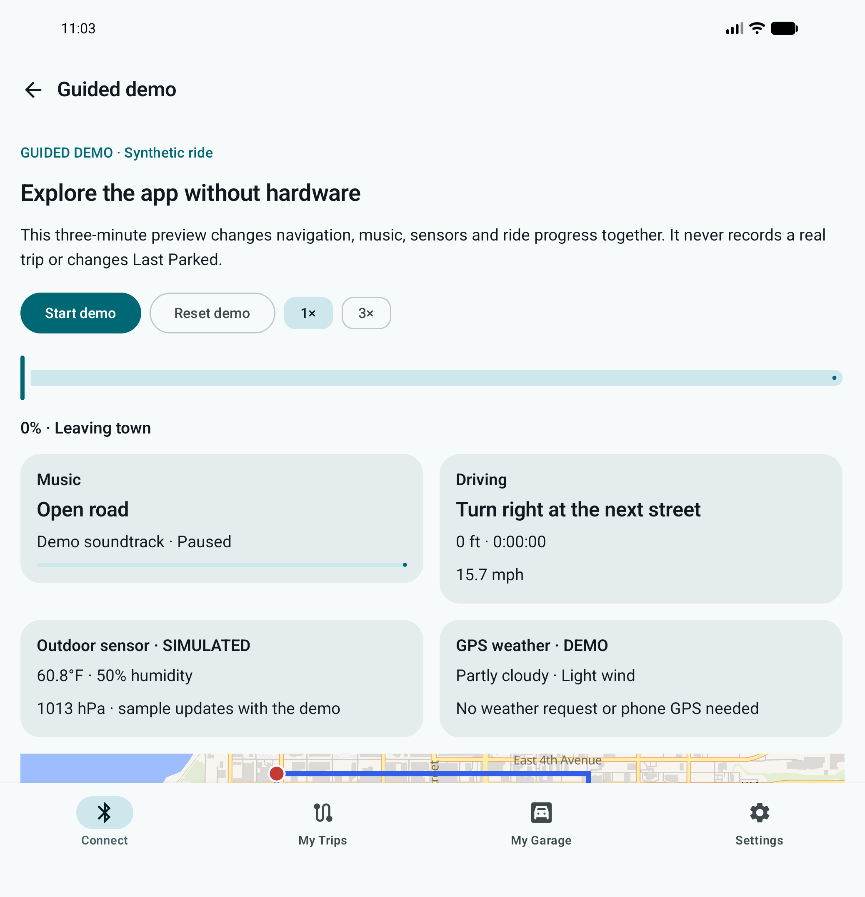
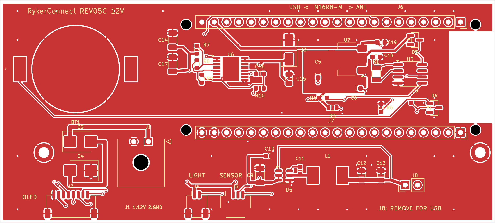

> **Hardware testing status:** I have not tested this project on physical hardware yet. I am still working on my hardware. Software and simulator checks do not establish that the physical hardware works.

# RykerConnect

A motorcycle companion app, ESP32-S3 display system, and hardware-free simulator, based on [JanB97/RykerConnect](https://github.com/JanB97/RykerConnect). This fork brings the Android software expansion and the revised JLCPCB carrier designs together. It is a prototype project, not a validated vehicle accessory.

## What is included

- **Android app:** Dashboard, Bluetooth connection tools, GPS ride recording and summaries, trip maps/replay/charts, photos, fuel and maintenance records, vehicle profiles, themes, home-screen widgets, and local backup/restore.
- **ESP simulator:** A virtual BLE peripheral connected through Android Emulator/netsim, with two browser-rendered OLED panels, settings, sensor controls, failure scenarios, and a guided ride.
- **Firmware:** PlatformIO sources for the revised boards, including the REV05 PCF8563 clock and BME280 sensor support.
- **Hardware:** Native KiCad designs, local libraries, Gerbers, JLCPCB BOM/placement files, wiring instructions, and prototype acceptance procedures.
- **Optional DadRides integration:** Publishing stays built into the Android APK and is disabled by default. The [DadRides website/API](https://github.com/neo12242/DadRides) lives in a separate repository. There is no separate plugin APK, and the app works without the website.

Phone and ESP editions now share ownership spending, modification tracking and service tools. Ride recovery, shared libraries and Wear OS controls are also included; see [current application updates](docs/CURRENT-FEATURES.md). Personal deployment notes, backups, credentials and ride data are excluded from source publication.

## Start here

| Goal | Guide |
|---|---|
| Try the app and virtual displays without electronics | [Simulator setup and use](Simulator/README.md) |
| Build/install the Android app | [Android setup](docs/ANDROID.md) |
| Learn the app's features | [User guide](docs/USER-GUIDE.md) |
| Select a PCB and find the JLCPCB upload files | [Hardware guide](Hardware/README.md) |
| Build firmware | [Firmware guide](Firmware/README.md) |
| Understand this fork's changes and limitations | [Changes](docs/CHANGES.md) |
| Develop from the maintained checkout and run baseline checks | [Development and validation](docs/DEVELOPMENT.md) |
| Configure the optional public ride site | [DadRides](https://github.com/neo12242/DadRides) |

## Visual tour

These development screenshots illustrate the app and simulator. Some show earlier navigation layouts. Demo routes and guided rides are synthetic. Click an image to view it at full size.

| Android dashboard | Trip maps and replay | Simulator sensor controls |
|---|---|---|
| [](docs/images/dashboard.png) | [](docs/images/demo-trip.png) | [](docs/images/sensor-test-bench.png) |
| Ride information, music, and navigation in one dashboard, with tabs for connection tools, trips, garage, and settings. | Explore a synthetic demonstration ride. The map marks its start and finish, while replay follows the recorded timeline. Gaps remain visible instead of implying continuous GPS coverage. | Toggle virtual sensors and test missing or stale readings. This screen models the earlier DS3231 clock; REV05 hardware uses PCF8563 and requires separate physical testing. |
| [App user guide](docs/USER-GUIDE.md) | [Ride features](docs/USER-GUIDE.md#rides) | [Simulator setup and controls](Simulator/README.md) |

### Try it without hardware

The guided demo previews music, navigation, sensor readings, and ride progress. Playback controls let you start, reset, and change speed without recording a real trip.

[](docs/images/guided-demo.png)

See [foldable presentation setup](Simulator/README.md#optional-foldable-presentation).

### REV05C-12V carrier board

KiCad top-layer artwork for the cost-reduced carrier prototype, showing module sockets, battery holder, power circuitry, and peripheral connections. **This is design artwork—not a photograph of assembled or tested hardware.**

[](Hardware/REV05C-12V/validation/board-F.png)

See the [hardware guide](Hardware/README.md) for revision selection, matched JLCPCB upload files, separate purchases, and power precautions.

## Quick start: Windows simulator

The first run requires Android Studio/SDK, a Google APIs x86_64 emulator named `RykerConnect_Pixel_7`, Python 3.13, a built debug APK, and the simulator's Python environment. See the [full guide](Simulator/README.md) before running these commands from the repository root:

```powershell
cd Android
.\gradlew.bat assembleCompanionDebug assemblePhoneDebug
cd ..
py -3.13 -m venv Simulator/.venv
.\Simulator\.venv\Scripts\python.exe -m pip install -r Simulator/requirements.txt
& '.\Start RykerConnect Demo.cmd'
```

In the app, open **Connect**, select **RykerConnect-MainUnit**, and pair with the simulator's public test PIN **123456**. The OLED preview opens at <http://127.0.0.1:8876/>. Use **Settings**, **Test scenarios**, and the **I2C test bench** to explore. No physical ESP or Bluetooth dongle is needed for the virtual connection. An intercom is not simulated.

The simulator models protocol/display behavior; it does **not** execute ESP firmware or emulate electrical hardware. Its RTC controls model the earlier DS3231 behavior, while REV05 hardware uses PCF8563. Neither validates the other electrically.

## Hardware status

The latest cost-reduced accessory-power prototype is **REV05C-12V**. **REV05-USB** is a separate USB/regulated-5V option. Use a variant's Gerbers, BOM and CPL together. Do not mix revisions. Read [power selection and bench acceptance](Hardware/REV05C-12V/POWER-AND-TEST.md) before applying power. USB and external power must not be connected together with J8 closed.

JLCPCB placement/model alignment, through-hole assembly acceptance, physical boot, sensor wiring, thermal behavior, enclosure fit and vehicle testing remain pending. Past pricing/stock observations are dated snapshots, not current quotes. The development board, displays, sensor, battery and mating cables are separate purchases.

## Privacy and configuration

The published source excludes local pairing keys, owner keys, SDK paths, app-data backups, ride/receipt exports, logs and development caches. Local setup creates new private files; keep them ignored. Never upload `Simulator/bonds.json`, DadRides `.dev.vars`/`owner-local.txt`, signing keys, or app backups. Backups are not encrypted and may contain locations, vehicle details and original photo metadata.

DadRides uploads only after enabling/configuring the integration and preparing a public copy. Review route trimming and selected photos before publishing. Endpoint trimming is not a guarantee of anonymity. The site does not need a Cloudflare account token in the app.

## Repository layout

`Android/`, `Simulator/`, `Firmware/RykerConnect-REV05/`, and `Hardware/REV05C-12V/` are the current entry points. Older local revisions remain for reference and generation dependencies. Upstream `AndroidApp/`, `Software/`, `Firmware/MainUnit_ESP32S3-REV01/`, `Hardware/KiCad/` and `CAD/` are retained for provenance; their APKs/firmware and enclosure are not the updated release. Build the current source instead.

## Attribution and license

Original project by [JanB97](https://github.com/JanB97), with upstream contributors and notices preserved. This fork retains the upstream [GPL-3.0 license](LICENSE). The [original README](docs/UPSTREAM-README.md) records upstream limitations. Dependencies and vendor documents retain their respective notices and licenses.
